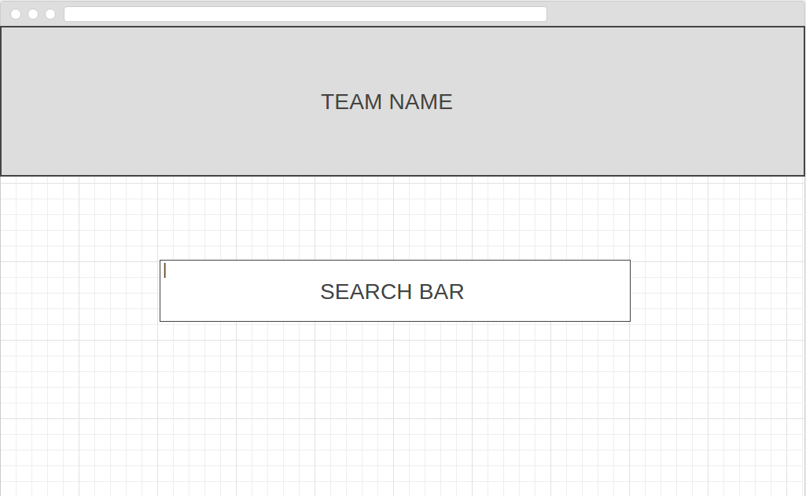
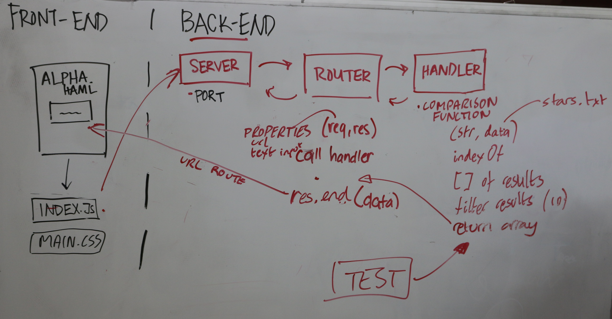

## Link to Website:
To check out the app, please click [here](https://facn2.github.io/Alpha.HAML/.)
## How to Access:

We want to create a word finder that is able to perform an autocomplete function.

## User Story:

### As someone who wants to look up stars:

* Be able to find suggestions from the first letter input
* Update search criterias as we keep refining our input

### Stretch Goal:
* To be able to press ‘search’ and find informations, including coordinates, of the stars
* Lovely CSS layouts

## Wireframe:

## Architecture:

## Code Guidelines:
* CamelCase for variable names
* Comments for code clarification
* Remove all unncessary 'console.log'

## Team Checklist:
* Decide and sort the database
* Construct basic app architecture
* Create back-end server
* Create front-end client
* Establish Heroku
* DONE!
